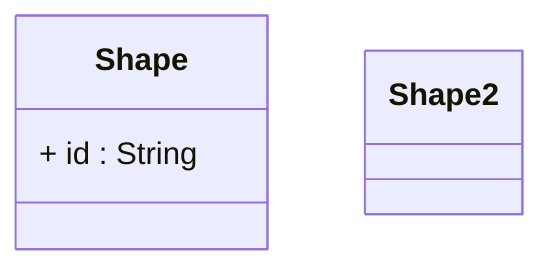

* TOC
{:toc}

# mermaid란 ?
- 인어

# Test

```mermaid!
classDiagram
    class Shape {
        + id : String
    }
    link Shape "https://www.github.com" "This is a tooltip for a link"
    class Shape2
    click Shape2 href "https://www.github.com" "This is a tooltip for a link"
```  
